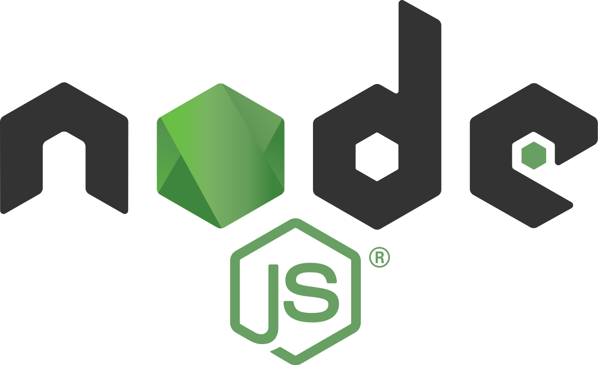

### Hi there 👋

My name is Anastasia, or Nastia for short. 

### 🔥 My tech stack:

## 🌱 I’m currently learning ...

- Front-end development @[Yandex Practicum](https://practicum.com/)
- React.js at @[Scrimba](https://scrimba.com/)
- Creative CSS with [Jen Simmons](https://jensimmons.com/)

## 🔭 I’m currently working on ...

- Publishing a digital magazine about yoga & mindfulness, [Shut Up & Yoga](https://shutupandyoga.com/)

## 🌎 I’m looking to collaborate on ...

- Coding projects with a good cause (talk to me if you're working with animal rights 🐷 or environment!)

## 📫 How to reach me: 

- Telegram: @abuterina
- Facebook: @anastasiabuterina

<!--
**buterina/buterina** is a ✨ _special_ ✨ repository because its `README.md` (this file) appears on your GitHub profile.

Here are some ideas to get you started:

- 
- 🤔 I’m looking for help with ...
- 💬 Ask me about ...
- 😄 Pronouns: ...
- ⚡ Fun fact: ...
-->

